Preprocessing of fMRI Data in SPM 8

Lab 1

BME 499/Biostat 642

By

Bob Spunt Emre Demiralp Scott Peltier Robert Welsh John Jonides

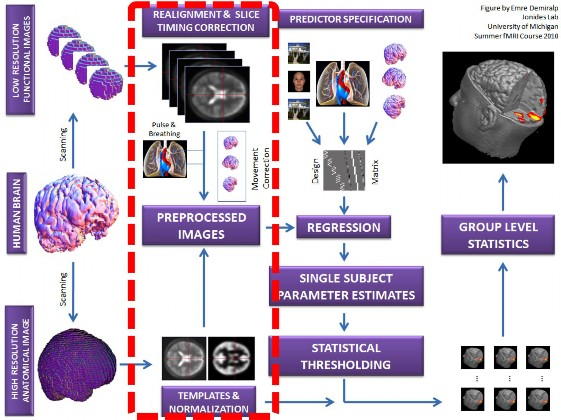

# Contents

Goals of this Lab ……………………………………………………………………… 3 Preprocessing Overview ……………………………………………………………… 4 MATLAB, SPM, Data Setup …………………………………………………………. 5 Preprocessing I : Checking Motion Correction ………………………………………. 19 Preprocessing II: Coregistration ……………………………………………………… 20 Preprocessing III: Spatial Normalisation ……………………………………………… 23 Preprocessing IV: Smoothing ………………………………………………………… 32 Appendix ……………………………………………………………………………… 34

# Goals of this Lab

After this lab you will

1.  Be able to examine data using SPM's single- and multi-volume display facilities.

2.  Be able to characterize the susceptibility artifacts and signal voids in functional data, as compared to similar structural data.

3.  Be able to evaluate the quality of functional image motion correction (realignment).

4.  Be able to perform coregistration between the low-resolution and high-resolution structural images. You will understand the implications for an image to be the "Source" vs the "Reference" in terms of the "world space" of each image.

5.  Be able to perform spatial normalization, check its success, and apply the transformation.

    Processes indicated by gray filled boxes have already been done for you. During this lab you will be verifying that these steps worked as intended as well as performing the coregistration, normalization, and smoothing steps.

    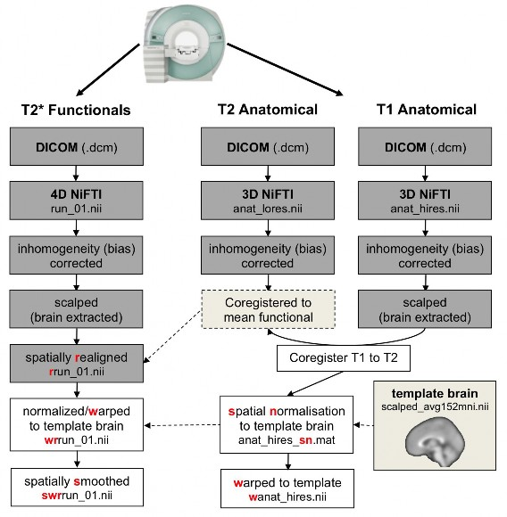

    The whiteboard shows the location of the course data. Write it here for reference:

    <<DataDir>> =

    Throughout this lab exercise this marker <<DataDir>> refers to the directory path from the whiteboard (or wherever the DVD data lives on your computer). Always replace

    <<DataDir>> with the actual path to the data.

    Verify you can see this directory, and that it has data for the 10 subjects listed below. It should also have data for an 11th  subject named “subBAD”. This subject was included to show you what bad data looks like.

    Fortunately, the data for the subjects 01-10 is the opposite of bad. Therefore, the majority of your time will be spent analyze data collected on them. Today, you’ll primarily focus your analyses on one of the following 10 subjects. You get to choose. Once you’ve chosen, circle your subject’s ID:

    <table style="border-collapse:collapse;margin-left:60.7949pt" cellspacing="0">

    <tbody>

    <tr style="height:25pt">

    <td style="width:72pt">

    sub02

    </td>

    <td style="width:72pt">

    sub03

    </td>

    <td style="width:72pt">

    sub04

    </td>

    <td style="width:53pt">

    sub05

    </td>

    </tr>

    <tr style="height:25pt">

    <td style="width:53pt">

    sub06

    </td>

    <td style="width:72pt">

    sub07

    </td>

    <td style="width:72pt">

    sub08

    </td>

    <td style="width:72pt">

    sub09

    </td>

    <td style="width:53pt">

    sub10

    </td>

    </tr>

    </tbody>

    </table>

    Locate MATLAB under the Start menu and start it (it is also on the desktop).

    The first thing you should do after starting MATLAB is to change the working directory to a reasonable place. In the computer lab you do not have write permissions in the default directory. Use the "..." button at the top of the MATLAB window (depending on the version of MATLAB you’re using, this button may be represented by an open folder icon with a downwards pointing green arrow on it), or use the "cd" command to change to the <<DataDir>> directory. If you use the **cd** command you would have to type:

    cd <<DataDir>>

    Now, add the following directory to the path, by either using the "Set path..." button under the “File” menu, or entering “pathtool” in the command window:

    #### C:\SPM8

    #### Click the "Add Folder..." button to select the SPM8 folders.

    #### DO NOT add with subfolders. Click "Close", and save this path for your future sessions.

    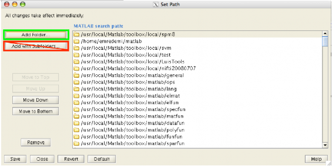

    # Check defaults

    

    When SPM is first installed it is important to review and set the defaults, found in spm_defaults.m. Navigate to the C:\spm8 directory and open the SPM8 directory. **Find the file "spm_defaults.m" and open it** (it should open in the MATLAB m-file editor).

    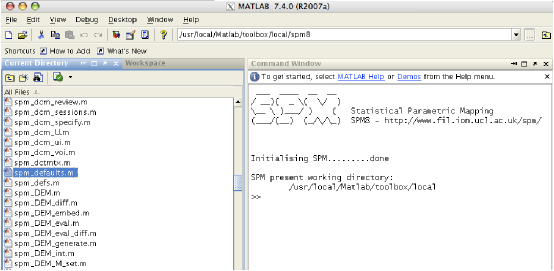

    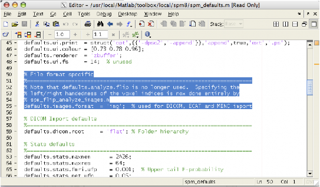

    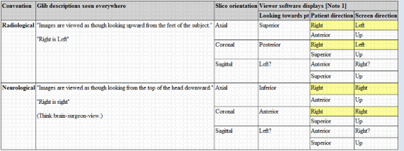

    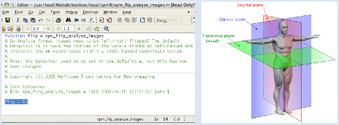

    <table style="border-collapse:collapse;margin-left:5.165pt" cellspacing="0">

    <tbody>

    <tr style="height:170pt">

    <td style="width:428pt;border-top-style:solid;border-top-width:1pt;border-right-style:solid;border-right-width:5pt;border-right-color:#DBE5F1" colspan="3" bgcolor="#DBE5F1">

    Sidebar: Analyze Orientation Defaults

    If you have the old style Analyze img/hdr pairs you should educate yourself on the flipping of images based on spm_flip_analyze_images.m. When first installing SPM it is crucial to set the "flip" default correctly. Find the line with **flip** in spm_flip_analyze_images.m. A value of 0 indicates that "SPM" Analyze images are expected; such images are often referred to as "Neurological" Analyze. A value of 1 indicates that official Analyze images are expected; these images are sometimes called "Radiological". If your lab uses Analyze format, then this value should be set once, verfied, then never changed. (The images you’re about to analyze are in the NIFTI format, which is Radiological. _Please see Appendix for more information on NIFTI_).

    </td>

    </tr>

    <tr style="height:28pt">

    <td style="width:439pt;border-left-style:solid;border-left-width:1pt;border-bottom-style:solid;border-bottom-width:1pt;border-right-style:solid;border-right-width:1pt" colspan="5" bgcolor="#DBE5F1">

    For more information, see: [http://eeg.sourceforge.net/ANALYZE75.pdf](http://eeg.sourceforge.net/ANALYZE75.pdf)

    </td>

    </tr>

    </tbody>

    </table>

    Maximum Memory default:

    The amount of data acquired during a functional brain scanning session is large. Computers need to analyze these data in portions and in order to do that, the matlab package SPM processes data in "chunks". The maximum chunk size is determined by the **defaults.stats.maxmem** setting**.** In the factory, this is set to "2^26", which allows SPM to run on even the most feeble computer.

    However the computers you are using in this lab can process larger chunks of information therefore we increased this limit to 2^29 (as you can see in spm_defaults.m) When you are running SPM in your own computer you can safely set this to as much as half of your computer’s total RAM. So for instance, if you intended to use 1/2 Gigabytes of memory you would type in

    defaults.stats.maxmem = 2^29;

    in spm_defaults.m and then save the file.

    Now we have set the defaults such that we can begin using SPM. (You may close the editor window displaying spm_defaults.m)

    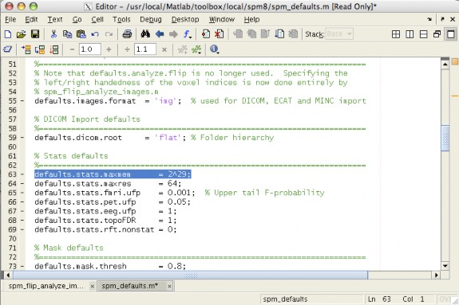

    # START SPM

    

    In order to start SPM, back in the Matlab command window, type **spm** to start SPM8 and select "fMRI timeseries". (You can also just type **spm fmri** in the command window.) You should get windows like the ones below…

    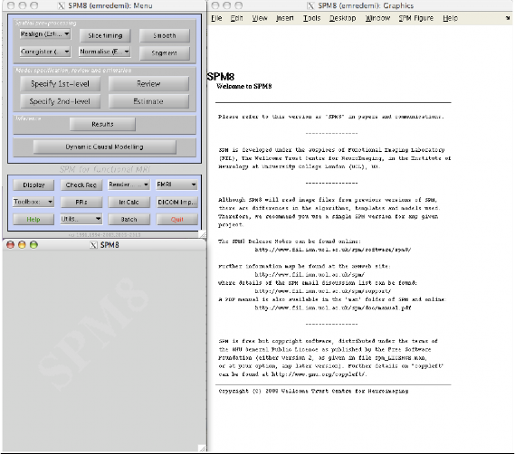

    # Selecting files in SPM8 & examining functional data

    

    You should always examine your functional images to check orientation and to detect any possible catastrophic problems. SPM package has tools that make it easy to do this.

    SPM has a user interface, which allows the user to choose the images that they intend to explore. This is accomplished by the file selection box, which is brought whenever you try to display images. For those of you not familiar with SPM, this box has certain features that might be counterintuitive. Let’s walk through the steps:

    1.  Use the "Display" button to bring up the dialog that will allow you to choose the functional image you are intending to explore. The SPM8 select dialog, which is invoked by clicking the display button, shows folders on the left and files on the right. Once you select a file it will show up on the bottom of the dialog. You may navigate through folders with a *single* click.

    2.  Now you need to navigate to <<DataDir>> where you will find subject directories named after the date of the acquisition and subject's initials (e.g. "sub05"). Functional data are in each subject's directory in "func/whyhow/run_01"; "rrun_01.nii" is the data after motion correction as was covered in lecture. Note that these are 4D NIFTI images, with all of the acquired images in one file.

        

    3.  The select interface initially assumes that all files are 3D Analyze files, i.e., that they only contain a single volume where a volume refers to the signal acquired from the subjects’ brain at one time point in the experiment. This is reflected in the ",1" after the filename. Since we are intending to display image number 100 we need to be able to see all the volumes. In order to do this we need to c**hange the volume specification to “1:300”** in order to see all the volumes in the directory (as displayed in the screenshots below). Now you can scroll down until you find rrun_01**.nii,100**. Click on the filename so that it appears in the bottommost window, as in the screenshot on the right. Then click **Done**.

        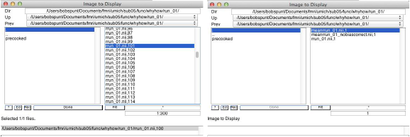

        Helpful tips: select images dialog

        If you accidentally select a file (removing from the list on the right, moving it to the list on the bottom) you can de-select it by clicking on it. Unfortunately, that file does not re-appear in the list on the right. To refresh the list of files on the right, hit the “Filt” button.

        Using the SPM Display Dialog

        Now that the display dialog is open you may click around the orthogonal views of the brain (coronal, sagittal, transverse) in order to explore your images.

        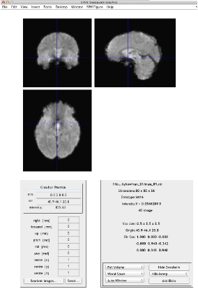

        

        #### CORONAL

        

        #### TRANSVERSE

        

        #### SAGITTAL

        1.  What is the voxel size?

            

        2.  What are the image dimensions?

            

        3.  What are typical gray matter intensity values?

        4.  On the lower right hand side of the display dialog you may see the kind of interpolation being used in visualizing the images. **Bilinear** interpolation is default. First select **Nearest Neighbor** interpolation and explore the image. Next select **Sinc** interpolation and again explore the image.

Which interpolation do you prefer?

Why? It doesn’t really change anything substantial.

# Compare the functional data to the anatomical data

Now that we have explored the functional image of our choice we should make sure that the functional images are in the same space as the anatomical images that we have acquired for each subject. The anatomical data are found within each subject’s directory

#### i.e. <<DataDir>>\sub05\anatomy

Anatomical images in general have smaller in-plane voxels (i.e. greater in-plane resolution) but they have the same number of slices with the same spatial location. In order to ensure that functional and anatomical images are lined up (coregistered) we need to check their registration. This is accomplished by clicking the **Check Reg** button in the SPM dialog

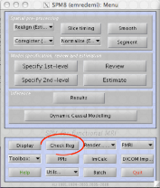

#### Click the Check Reg button.

1.  Note that the Check Reg button brings up a dialog box that is very similar to the one you have seen in the Display example in the previous section. One of the differences is that the Check Reg dialog will allow you to choose multiple files for you to be able to check their coregistration.

    Since we are checking the registration of the anatomical (anat_lores.nii) and functional (e.g.,

    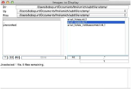

    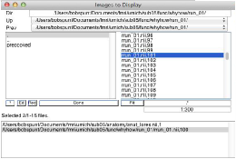

    rrun_01.nii,100) we need to make sure that they are both present in the “Images To Display” portion of the dialog box. To do this, navigate to the anatomical subdirectory mentioned above and select **anat_lores.nii** and then navigate back to the directory in which functional images reside and select rrun_01.nii,100\. Then click **Done**.

    ### Helpful tips: Windowing

    You can modify the contrast of the images by playing with the range of min-max values to be displayed as described below and shown in the figure above. In one of the 3 views, right-click; a context menu will appear, showing you the location of the cursor and the intensity of the voxel under the cursor (shown as "Y

    = 456", for example). From the context menu, select:

    Image:Window:local:manual

    and enter a new minimum and maximum value. Try 0 and 110% of typical values. For example, if most of the brain is around intensity 1000, a good maximum is probably 1050 and you would enter "0 1050".

    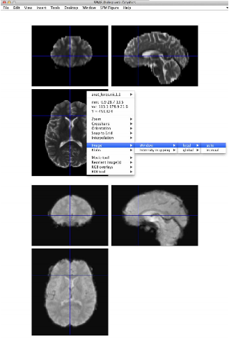

    

2.  Note that now you see both the anatomical and functional images in the same window. If you click around one, note that the crosshair in the other will also move. This is how one checks whether two images are correctly coregistered. Specifically, there are certain landmarks in the brain, which are used to ensure that all parts of the brain are correctly coregistered.

Explore the pair of images, making sure to compare the following anatomical regions:

1.  Frontal pole

2.  Occipital (posterior) pole

3.  Left & Right sides (e.g. superior temporal gyrus)

4.  Corpus callosum:

    1.  Most anterior,

    2.  Most superior,

    3.  Most posterior extent.

Do the functional and structural line up well? If not, how so?

Explore the regions of signal loss as we described in the morning lecture. This usually happens in the temporal poles and the orbitofrontal cortex.

Temporal Poles

Orbitofrontal Cortex

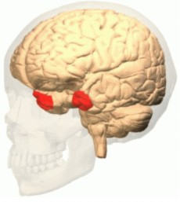

On the anatomical image, go to the medial orbitofrontal cortex and look at the sagittal image; click on the coronal or axial until you have nice view on the sagittal image---that is, not right on the mid-sagittal plane (to avoid the cerebral fissure), but just off mid- sagittal.

Now click around on the sagittal view, keeping an eye on the axial view, and carefully compare the T1 and the functional.

Similarly, find the signal void in the temporal lobe (due to the ear canal). Observe cortex visible in the T2 anatomical image not visible in functional (T2*) image.

When we get thresholded activation maps, we typically overlay them on the structural images since they have more anatomical detail. But why should we *also* check localization of activation on the functionals?

# Preprocessing I: Checking motion correction

Two key preprocessing steps have already been applied to the functional data: functional image registration ("realign"ment, or motion correction), and coregistration of anat_lores.nii with the realigned functional images. In this section, we’ll be evaluating the results of the image realignment step. As noted earlier, subjects 01-10 in this dataset were all stellar participants in that they all kept their head very still while their functional images were being acquired. The subject named “subBAD” did not. Therefore, let’s temporarily focus on the functional data in <<DataDir>>/subBAD/func/whyhow/run_01.

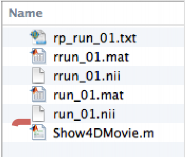

A particularly powerful way to check motion is to view a movie of the image timeseries before and after motion correction. You may have noticed that subBAD has an m-file named “Show4DMovie.m” in their functional image folder. To start the function, navigate to this folder and enter the following at the command line:

>> Show4DMovie

Once you hit enter, you will then be prompted to select three files that will be used to make the movie:

<table style="border-collapse:collapse;margin-left:5.12988pt" cellspacing="0">

<tbody>

<tr style="height:17pt">

<td style="width:27pt">

1.

</td>

<td style="width:115pt">

run_01.nii

</td>

<td style="width:233pt">

-­‐ the 4D file before motion correction

</td>

</tr>

<tr style="height:13pt">

<td style="width:27pt">

2.

</td>

<td style="width:115pt">

rrun_01.nii

</td>

<td style="width:233pt">

-­‐ the 4D file after motion correction

</td>

</tr>

<tr style="height:17pt">

<td style="width:27pt">

3.

</td>

<td style="width:115pt">

rp_run_01.txt

</td>

<td style="width:233pt">

-­‐ the realignment parameter file

</td>

</tr>

</tbody>

</table>

Once the program loads the data, the movie will start in a figure window like the one shown on the next page.

*   The top two images show the timeseries before and after motion correction from the same sagittally oriented slice.

*   The bottom two images plot the timeseries of the estimated head translations (in mm) and estimated head rotations (in degrees).

*   The position of the moving vertical lines corresponds to the number of the image being show above.

Once the movie finishes, you should see a prompt at the MATLAB command window asking you if you’d like to re-play. Once you’re satisfied, answer the questions on the following page.

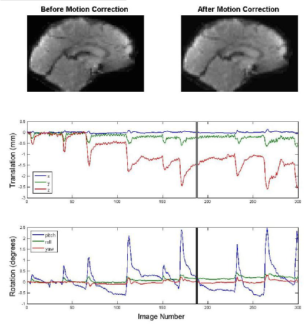

On which dimension of **translation** did subBAD move most?

On which axis of **rotation** did subBAD move most?

Can you see any residual head motion in the image time series after motion correction?

Should subBAD be excluded from the study? Why or why not?

# Preprocessing II: Coregistration

SPM's "Coregister" facility is used for registering different types of images from the same subject (it is a "intermodality, intrasubject" registration). To use it you must specify a "Reference" image, which does not move, and a "Source" image, which is transformed to match the reference.

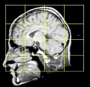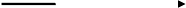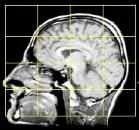

Historical Note: In SPM2, the rigid body transformation was recorded in an auxiliary

.mat file named like the source image. With SPM5/SPM8 and the use of the NIFTI file format, this information is now stored in the header of the source image. With either SPM2, SPM5, or SPM 8 it is not necessary to write out the transformed image (the Source transformed into the space of the Reference), though it is sometimes convenient to do so.

Before coregistering the low- and high- resolution structural images we need to (I) make sure the two images are in the same orientation and not too far from one another, and (II) correct for intensity inhomogeneities in the high-resolution MPRAGE image.

1.  First see how close the anat_lores and anat_hires images are to start with. What button do you use to view more than one image?

    

    Multiple images are displayed in the space of the first image. If they are not

    previously registered this simply means that their origins are lined up.

    Neither image has had their origin set. The default origin is the center of the volume. To see the specific voxel that is defined as the origin, use 'Display' and look in the lower right panel.

2.  If the images were very out of register we could try to get the images closer by manually setting the origin to the Anterior Commissure (AC).

    1.  On the board will be a diagram of how to find the AC on the midsagittal plane. Sketch it on your worksheet:

        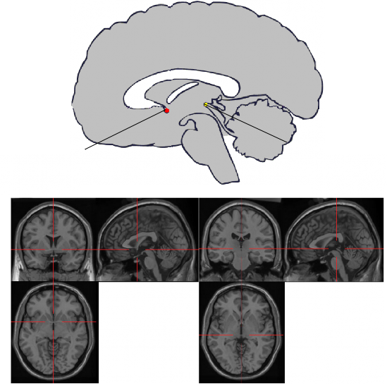

        Anterior Commissure

        Posterior Commissure

        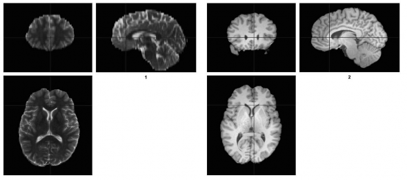

    2.  Now use the Display button to view the anat_lores image and find the location, as best as possible, of the AC (Disregard the blue cross hair in the images above). You should be able to see it on the axial slice.

        Hint: Once you are close, it helps to "zoom in". In the display facility, click on the "Full Volume" pop-up menu; select "80x80x80 mm"

        What is the location of anat_lores's AC in voxels?

    3.  Use the Display button view the t1spgr image and locate the AC, as best as possible. What is the location of t1spgr's AC in voxels?

        Voxels

        mm ?

    4.  At this point we *could* set each image's origin using "Reorient images..." button in display but we won't. But just for reference...

        

        How to change the origin (again, don't do it now!)

        View the image whose origin you want to set, using the 'Display' button. By default, the crosshairs start at the currently-defined origin. (If you've previously been using 'Display' facility, and you're not at the 0,0,0 mm point, click the bar below the title "Crosshair Position".

        To change the origin, take the AC location in mm and *multiply* by -1.

        Enter these three values in the first three boxes on the left ("right {mm}", "forward

        {mm}", "up {mm}"). See where the crosshairs are located. If they are over AC, then you can continue. Otherwise, you need to adjust the shift values until the crosshairs are over AC.

        When the crosshairs are right on AC, you've found the correct shifts to move the previous origin to AC. Click "Reorient images...". Select the set of images (any number!) in the same space whose origin you want to change.

        We're not changing the origin for two reasons. First, the images *should* already be quite close, but there's a more important reason.

        By setting the origin on the Reference image (anat_lores), we change its "world space"; specifically, the origin of its world space moves from the center of the volume to the AC. Hence it will no longer have the same world space as the functional data

        *unless* we identically change the origin on all the functional data and any results (beta*, con*, spm_T* etc) we already created.

        To summarize, if the images are way off, we can set the origin manually to help the Coregistration. But if we change the origin of the image representing the functional space, we have to similarly change the origin on all functional images.

3.  Two processing steps have already been performed on the structural images. They have had been scalp-edited and corrected for inhomogeneity.

    1.  Scalp-editing (also known as skull-stripping) is the deletion of non-brain regions of the image volume, i.e., the scalp and head. Since this extraneous information can throw off subsequent preprocessing the images have been scalped-edited with the Brain Extraction Tool (BET) from the FMRIB Software Library (FSL; [http://fsl.fmrib.ox.ac.uk/fsl/fslwiki/](http://fsl.fmrib.ox.ac.uk/fsl/fslwiki/))[).](http://fsl.fmrib.ox.ac.uk/fsl/fslwiki/))

    2.  Correction for inhomogeneity (also known as bias correction) accounts for the fact that anatomical images obtained with high-field magnets (> 2T), tend to be brighter in the center of the field of view than at the edge. This inhomogeneity can throw-off subsequent preprocessing, especially segmentation. Therefore, the images have been corrected for inhomogeneity. The uncorrected images have “_nobiascorrect” appended to them.

4.  Use Check Reg to compare anat_lores.nii to anat_lores_nobiascorrect.nii.

    1.  Can you see the greater intensity in the center of the uncorrected image?

        

    2.  Does the corrected image look better?

    ## Sidebar: Inhomogeneity Correction

    Images were corrected for inhomogeneity using two SPM8 functions. The first, _spm_bias_estimate.m_, estimates the image inhomogeneity. This estimate is saved in a “bias field” matrix that is used to correct for inhomogeneity using the second function, _spm_bias_apply.m_. In the following example, these functions are used to correct anat_lores.nii. It assumes that you are working in your subject’s anatomical directory:

    >> biasfield = spm_bias_estimate('anat_lores_nobiascorrect.nii');

    >> spm_bias_apply('anat_lores.nii', biasfield);

    If successful, this should yield a bias corrected version of the image with “m” prepended to the name (in this case, “manat_lores.nii”).

5.  You will now "Coregister" the high-resolution anatomical image (anat_hires) to the low-resolution anatomical image (anat_lores). The anat_lores image has the same space as the functionals, and hence this coregistration will set anat_hires' world space to correspond to the functionals. Make sure you know answers to the following:

    1.  What is your "Reference" image?

        

    2.  What is your "Source" image?

        

    3.  Click on the Coregister button. In the Batch Editor select New Coreg: Estimate

        1.  Double click Coreg: Estimate, then

        2.  Set the Reference and Source images you identified above.

        3.  Now "Run" the job to perform the coregistration.

            The transformation parameters are written into the NIFTI file of the source image anat_hires (if a file initially has an Analyze header, it is silently converted to a NIFTI header). _Please see Appendix for more information on NIFTI._ This action sets the world space of anat_hires to match that of anat_lores. Given that the world space of anat_lores already matched that of the functional images, this means that the anat_hires is now in the world space of the functional images.

            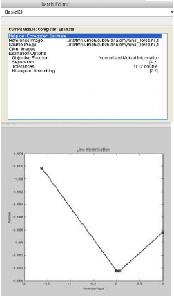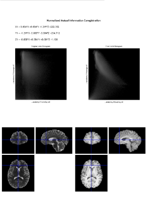

    4.  Note changes in world spaces.

        "Display" anat_lores.nii and use the "World Space"/"Voxel Space" pop-up button to change between the two spaces.

        Does the image move as you flip between the two spaces?

        

        "Display" anat_hires.nii and do the same again.

        Does the image move as you flip between the two spaces?

        

        Why do the images move between spaces?

        

    5.  Check the success of the Coregistration.

        Use check reg to check the registration. Check the points mentioned before:

        1.  Frontal pole

        2.  Occipital (posterior) pole

        3.  Left & Right sides (e.g superior temporal gyrus)

        4.  Corpus Callosum

            1.  Most anterior

            2.  Most superior

            3.  Most posterior extent

        5.  Trace the sulci

Has the coregistration succeeded?

# Preprocessing III: Spatial Normalization

Spatial Normalization is used for intersubject (between subject) registration. It is essential for performing intersubject analyses for determining Talairach/MNI coordinates of activation foci.

While the "Normalise" button can accept any kind of image (T1, T2, etc), to register your subject into the standard atlas space, it is important to use the highest resolution structural data.

1.  For us, that is which image:

    

    (Check your answer before continuing on!)

    Spatial normalization (or, with a British spelling, normalisation) takes three types of images

    1.  "Source images"

        These are the high resolution anatomical images from which the spatial transformation is determined. Typically you only specify *one* such image per subject.

    2.  "Images to Write" (normalised)

        These are other images *with* *the* *same* *world* *space* as image (i) above. Typical examples would be statistic or contrast images, or whole set of ra* functional images.

    3.  “Template Image(s)

        Images that define the standard atlas space. You get to choose from images that match the type (or "modality") of the image in (i).

        It produces a "*_sn.mat" file, which records the nonlinear transformation *from* the

        *world* *space* of image (i) *to* the atlas space.

2.  Now that we have coregistered, what does the world space of anat_hires correspond to?

    

3.  Thus if we spatially normalize anat_hires the resulting anat_hires_sn.mat file will not just be good for anat_hires, but for...

    

    Click 'Normalise' to start the spatial normalization process. Select "Normalise: Estimate & Write" in the drop-down menu, find the “Data” item in the hierarchy and click "New Subject" (for now, just do one subject). Under “Subject”, for "Source image", select anat_hires.nii, the homogeneity-corrected, scalp-edited, hi-res anatomical image that is now in the space of the functionals.

    For "Images to write", select again anat_hires.nii.

    Under "Estimation Options", find the one non-default item, "Template images". For the template, select scalped_avg152T1.nii (in <<DataDir>> \template\). This image is an average of 152 subject's T1 images, from the MNI/ICBM, smoothed with an 8mm filter, which was *then* been edited of scalp by folks in the Jonides lab. (ICBM=International Consortium for Brain Mapping).

    Save this job (by clicking the save icon or choosing Save Batch under the File drop- down menu), using a descriptive name (e.g. “norm_job_subj1”). This saved job can be reloaded and manipulated without going through the setup procedure again.

    Click “Run” to run the job, after a short while it will finish. This will create a anat_hires_sn.mat and reslice the requested file, creating a wanat_hires.nii.

    Check the success of the registration, comparing the normalized image (wanat_hires.nii) to the unsmoothed version of the template image that is avg152T1.nii in the SPM8\canonical directory.

4.  Using the landmarks suggested above, has the spatial normalization succeeded?

    

    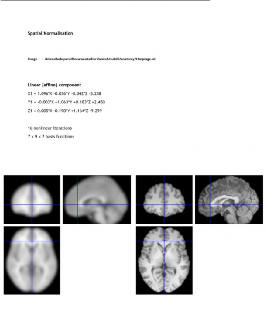

5.  Above, we noted that the “Estimation” part of “Estimate & Write” saves the nonlinear transformation necessary for normalizing any image that is in the same space as (or co-registered with) the anat_hires.nii. The file it saves should be located in the same directory as anat_hires.nii, and should be named anat_hires_sn.mat. Now, we can use this file to normalize the functional images. To do so, first click ‘Normalise’ as before. Given that we’ve already estimated the nonlinear transformation (and have the *_sn.mat file to go along with it), we should select “Normalise: Write” in the menu. Find the “Data” item in the hierarchy and click "New Subject" as before. Under “Subject”, for "Parameter File", select the anat_hires_sn.mat we just estimated. For "Images to write", you’ll want to select all 300 functional images. Navigate to that subject’s “func/run_01” directory and change the volume specification to 1:300 as before. Then, first select rrun_01.nii, 1, and then scroll down and shift-select rrun_01.nii,300 to grab all 300 images. The select dialog should report "Selected 300 files". (If you select the wrong files right-click in the bottom selected file box, and select "Unselect All".)

    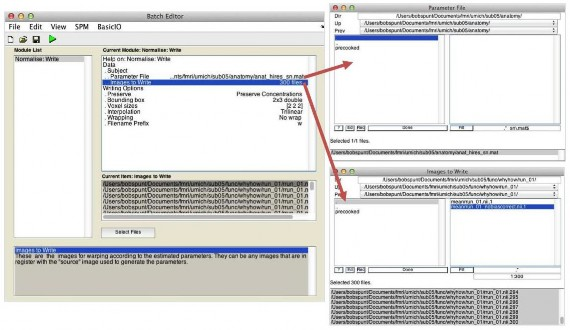

6.  Save and run your job. Given that this job will write a new 4D file, it will take a couple minutes to finish. When it does finish, you should have a file named “wrrun_01.nii” in the same directory as your original 4D functional file. Use the “Check Reg” function to visually examine the quality of the registration between the normalized anatomical (wanat_hires.nii) and one of the normalized functionals (e.g., wrrun_01.nii,300).

# Preprocessing IV: Smoothing

The only preprocessing step left to do for an intrasubject analysis is spatial smoothing (we'll use 8mm). This is done in order to increase signal to noise ratio (SNR) and the ability of statistical techniques to detect true and task related changes in the signal. We’ll use the Batch Editor module Spatial:Smooth to implement this.

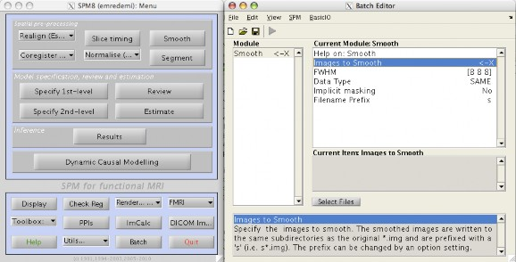

1.  #### Click the "Smooth" button in the top-left window. The graphics window now shows a 4-panel interface. The upper left shows the hierarchy of the current job; the bottom panel displays help messages (these are often quite helpful!); the right column of panels are used to input new values and review current values in the job specification. The top-left panel should show: Smooth <-­‐X

    The "<-­‐X" marker indicates that there are required options that have not been specified. As long as there are any "<-­‐X " markers present the job cannot be run (notice that the Run button is grayed-out)).

2.  If the window with the title “Current Module” is empty, double click "Smooth <-­‐X ". Six sub-options appear. The first item is SPM’s built in help on the topic of smoothing. The second item, “Images to Smooth”, since it bears the "<-­‐X " marker must be set. The other four already have default values set.

3.  Select "Images to Smooth" by single-clicking it. Then in the lower right, single-click "Select Files". Alternatively, you can double click “Images to Smooth”. Once you have the dialog open, select all 300 normalised images within your freshly written “wrrun_01.nii” 4D file. The selection procedure is the same as in the “Normalise: Write” job described above, but make sure you’re selecting the 4D file with “w” prepended to it. Once you’re sure you’ve selected all 300 normalised images, click ‘Done’, and confirm that the correct files were selected (as shown in the 2nd box in the right-hand column of the Batch Editor).

    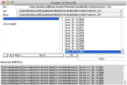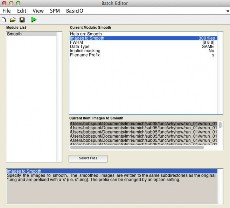

4.  Set smoothing. The interface allows us to specify things such as the width of the filter. Since we accomplish filter/smoothing by simply convolving our signal with a three dimensional Gaussian function we can specify the extent of smoothing by using the full width at half maximum (FWHM) of the Gaussian Kernel. This can be done by clicking "FWHM". Note that a default smoothing of "8 8 8" has already be set, so there is no need to change anything.

5.  Now it is time to start the job. You can do this by clicking the green filled triangle button or by selecting “Run Batch” under the file drop-down menu. (Note that at this point we could have clicked File> Save Batch to save the job in .mat, .m or .xml formats. For such a simple job, there is no point in saving the job.) You will notice that the window on the lower left hand side will display a progress bar.

6.  Smoothing creates images with a "s" prefix. Use "Check Reg" to compare the first and last image (1 and 300) from both the unsmoothed (wrrun*) and smoothed (swrrun*) 4D image files. (This will ensure that you smoothed all the images, and give you a visual feel for the impact of 8mm smoothing).

    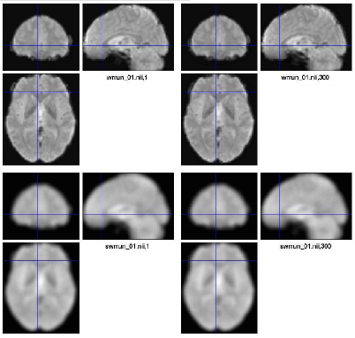

    

    # Notes on preprocessing

    APPENDIX

    

    There are several ways to check the quality of preprocessing stages in fMRI. You can check most of them using spm_check_registration (“Check Reg” in the GUI). If you or someone in your lab can do some scripting, it may be a good idea to automatically generate images that show the following for each subject and save them in an electronic “log book.” Here’s a suggested list:

    1.  Do the functional images appear coregistered with the anatomical image (overlay) you will normalize to the template?

    2.  Are the anatomical images you will normalize roughly in alignment with the template?

    3.  Do the normalized anatomical images seem closely matched to the template?

        

    4.  Do the normalized functional images seem to be in reasonable alignment with the template?

# NIFTI (Neuroimaging Informatics Technology Initiative)

The purpose of the Neuroimaging Informatics Technology Initiative is to support service, training and research to develop and enhance the utility of informatics tools used in neuroimaging, with a focus on functional magnetic resonance imaging (fMRI). NIFTI is jointly sponsored by National Institutes of Mental Health (NIMH) and the National Institutes of Neurological Disorders and Stroke (NINDS) which are part of the National Institutes of Health (NIH) and Department of Health and Human Services (DHHS). The Data Format Working Group (DFWG) of NIFTI is in charge of coming up with a technical solution to the problem of multiple data formats used in fMRI research. The NIFTI header that we refer to in this tutorial is the supplemental information that is placed at the beginning of the fMRI data. This header has the parameter settings for aspects of the data such as voxel size, affine transformation and number of slices. When two images are coregistered, the rigid body transformation that maps one image to the other is stored as quaternions, which are short forms of rotation/scaling/translation/shearing matrices, in the NIFTI header. A schematic description of how this information is used is included below.

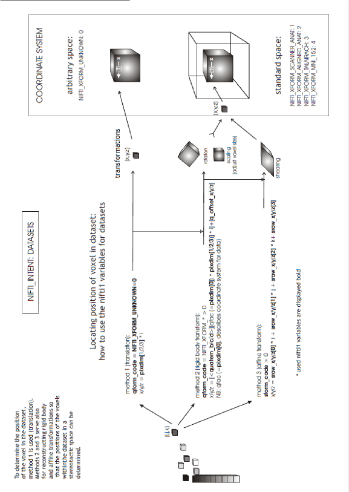

# Batch Job Basics

It is possible to use SPM commands and run batch jobs without having to use the graphic user interface. Experience with this will increase your speed and power in processing your data.

The following code uses the saved normalization job from above.

1.  The following commands let you bring up and run the Batch Editor from the command line in MATLAB.

    % brings up Batch Editor in interactive mode

    spm_jobman('initcfg') spm_jobman('interactive')

    % You can then create, edit, load, save, and run batch jobs; try loading the normalization batch file

2.  Alternatively, you can also load and run batch jobs from the command line.

    batchname=spm_select(1,'mat','Select batch file with normalization') load(batchname)

    spm_jobman('run', matlabbatch)

3.  You can also load batch jobs, and use the results in any other spm modules. This code loads the normalization batch file, and brings up the check registration window.

%Select and load batch file

batchname=spm_select(1,'mat','Select batch file with normalization'); load(batchname)

%Get file names

src = matlabbatch{1}.spm.spatial.normalise.estwrite.subj(1).source{1} template = matlabbatch{1}.spm.spatial.normalise.estwrite.eoptions.template{1}

%Append w to src name to select normalized file [dd, ff, ee] = fileparts(src)

wsrc = fullfile(dd, ['w' ff ee])

%Compare images spm_check_registration(char(template, wsrc));

ACKNOWLEDGEMENTS

We thank Luis Hernandez-Garcia, Doug Noll, Tor Wager and Thomas Nichols for their help in earlier versions of this document. Without their help, this lab would not have been as comprehensive.
