

## Goals of the Lab

  1. Learn how to specify and review single-subject regression models in SPM8
  2. Learn how to estimate these models and examine the model results in terms of specific contrasts
  3. In addition to modeling the average effect of an experimental factor with the BOLD signal, you will learn how to estimate models containing parametric modulators of BOLD signal
  4. Finally, you will learn what a nuisance covariate is at the single-subject level, and how to add nuisance covariates in your single-subject models

## What You'll Need for Your Single-Subject Analysis

Throughout this exercise, you'll be navigating in and out of your subject's data folder. Given that we'll be estimating our models on the normalized and smoothed functional data, you'll need the 4D functional files highlighted in blue below. Also highlighted in blue is the rp_run_01.txt file, which contains the estimated motion parameters for your subject. These will be included in our single-subject model as covariates of no interest (i.e., nuisance regressors). If you weren't able to complete every step of the preprocessing lab, you're in luck: the folder "precooked" contains them too.

The swrrun_01.nii file contains the dependent measure we're trying to model. In order to construct this model, you'll need to know what your subject was doing at every moment during the time series. Such information is contained in the subject's behavioral data, which is accessible to you in two formats shown below. You'll learn about the contents of these files shortly.

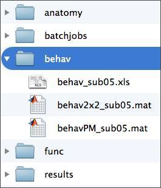

In addition, you'll need a folder in which to store your model. For this, your subject folder should already have a folder called "results", as below. Given that we'll estimate two different models, you'll want to create a separate output directory for each. You can do this manually through a file system window, or through the MATLAB command window using the command "mkdir". Whatever you do, do not save your model in either of the folders in the "precooked" folder in your results folder. Doing so would overwrite that data, which you may need.

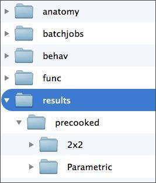

Before we launch SPM8, let's look at what participants were actually doing while images were being collected.

## Task Design

Participants performed the Yes/No Why/How Localizer Task which, for the same of brevity, will just be referred to as the Why/How Task. The task is described in detail in this  [publication](htmlfiles/Spunt_Adolphs_2014_NeuroImage.pdf). It uses the following 2 x 2 factorial design:

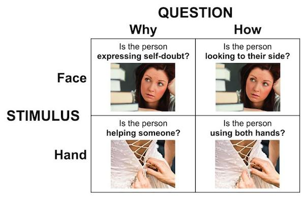

For the remainder of the labs, the terms "Why" and "How" will be used to describe the "Question" factor, while the terms "Face" and "Hand" will be used to describe the levels of the "Stimulus" factor. References to specific conditions will be in these terms, and will always lead with the level of the "Question" factor, e.g., WhyFace, HowFace, etc.

Task trials were presented in blocks of 8 trials each. The following schematic illustrates the timing of the individual events within each block.

Each block begins with question presentation, and is followed by a set of photographs paired with that question. Between each photograph is a brief reminder of the question for that block. For each photograph, participants have 1750 ms to respond. If they fail to respond by that time, the task advances. Responding before the end of the 1750 ms ends the trial and advances to the next trial. Hence, block durations were contingent on participant performance. However, total task duration was not, as the timing of the block onsets was fixed.

Below, you can see a movie showing the task as participant in the scanner would see it.

Don't watch the entire thing, but do check out at least a couple of blocks. Every second that passes in this video corresponds to one of the image volumes that you've preprocessed. By using the subject's behavioral data output, we can build a unique timeseries predictor for the four conditions in the 2x2 design. Then, by using the subject's fMRI data, we can can use a general linear model (GLM) determine the extent to which the four experimental conditions in our 2x2 design are related to activity at every voxel in the brain. This, then, allows us to use contrasts to determine the extent to which a voxel's response to the task is specific to one or more conditions. In SPM, these three steps are achieved in the following modules:

  1. Model Specification.
  2. Model Estimation.
  3. Contrast Manager

In the following walkthrough, you'll carry out these steps for two distinct models of the participants fMRI data. The first is designed to assess the specificity of the response to each of the four conditions in the 2x2 factorial design, and will be referred to as the "2x2" model. The second will examine parametric variability in response accuracy, and hence will be called the "Parametric" model.

## 2x2 Model Specification

Let's specify the 2x2 model. If you haven't already, go ahead and launch MATLAB and SPM8.

As shown below, enter the Batch Editor and use the drop-down menu to start an **fMRI Model Specification** job.

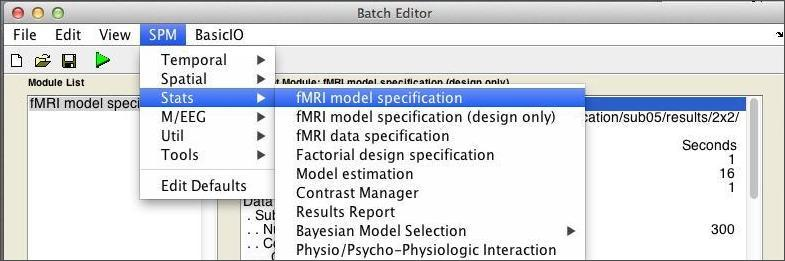

If the text is difficult to read, note that you can modify the font settings by selectiong **View:Change Font/FontSize** from the Batch Editor menubar. From top to bottom, these are the inputs we'll need to consider:

**Directory**. This is the **Output Directory** that you were instructed to create early, which should be:**&gt;&gt;DataDIR&gt;&gt;\results\2x2**

**Timing parameters**

  1. Units for design: Seconds
  2. Interscan interval: 1  [same as TR]
  3. Microtime resolution: 16  [DEFAULT VALUE]
  4. Microtime onset: 1  [DEFAULT VALUE]

**Data &amp; Design**Start by clicking on **New: Subject/Session,** then expand the **Subject/Session** hierarchy. Select the 300 smoothed/normalized (sw*) functional images for your subject.

Under **Conditions,** create four conditions (click **New Condition** four times). For each condition we need to set its **Name,****Onsets,**and**Durations** of the epochs within each condition. For that purpose, open the spreadsheet document referred to above, which is located in **&gt;&gt;dataDIR&gt;&gt;\behav** . It has two worksheets within it - you should be pulling data from the **2x2 Model** worksheet, which should have 8 columns like this:

You can copy and paste (use CTRL-C and CTRL-V) straight for the spreadsheet. Once you're finished, it should look like this:

To account for variance in the signal explained by minor changes in head position across scans, you should include the realignment (motion) parameters for the subject. As you may recall from the Preprocessing lab, these are stored in a rp*.txt located in the same folder as your functional data. You can load these parameters in to the model through the **Multiple Regressors** field, as shown below:

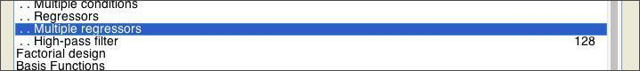

Stick with the default values for the remaining parameters.**Before you click run, save your Batch job.**By clicking **Run** you will generate the **SPM.mat** file that can then be "Estimate"d. While SPM.mat contains all of the details of the data and design it **cannot** be "Load"ed into the Batch Editor and modified. Hence it is crucial that you always "Save" the job in the Batch Editor **before** running it.

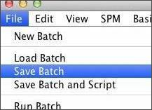

This allows you to load and easily modify the model if there are problems and if you want to make minor changes. Now, click **Run** . In the next section, you'll review the monster you just created.

## 2x2 Model Review

The SPM Figure window should now be displaying the **design matrix** that you just created. If the text is difficult to read, note that you can modify the font settings by selecting **SPM Figure:Font Size** from the Graphics figure menubar. The keyboard shortcuts CTRL-equals and CTRL-minus should also do the trick.

Your design matrix should have 11 columns. The first 4 correspond to the conditions of the 2 x 2 factorial design. Do you know what each of the remaining columns represent? Once you've settled that, you can see additional info about the design by selecting **Review** in the top-left window and then selecting the SPM.mat file you just created. Then, in the lower-left window you should select **Design:Explore:Session 1:WhyFace** as follows:

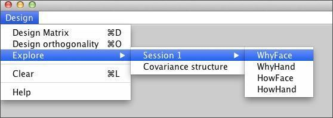

The graphics window shows the following:

  1. **Upper-left:** Predictor for this event
  2. **Upper-right:** Power spectrum of this event
  3. **Lower-left:** Displays the basis set used

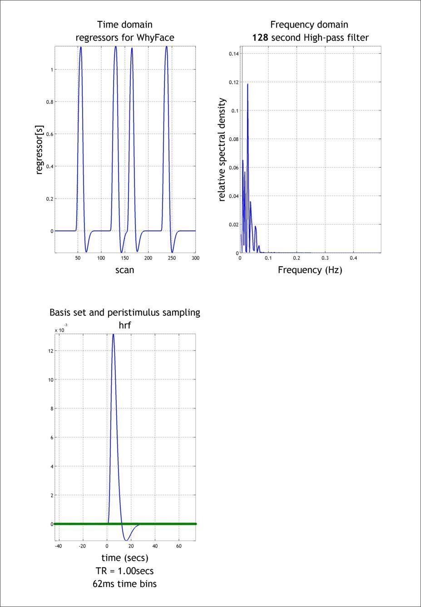

In **Design:Design Orthogonality** you can evaluate your model for collinearity (i.e, intercorrelation) amongst the regressors. This is important, because if two columns are nearly collinear you cannot distinguish their effects uniquely.

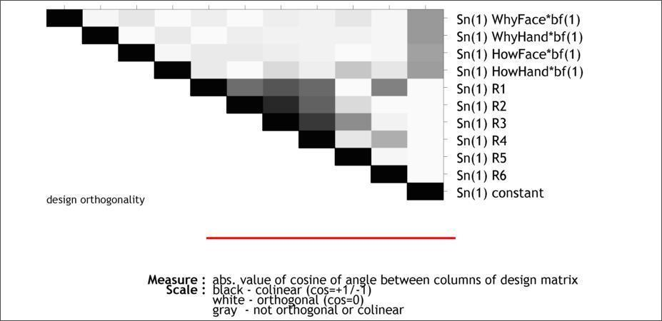

The color scale goes from **white** (zero correlation) to **black** (complete correlation). In this case, you should be most attentive to to the first four rows, since those represent the collinearity amongsts the four regressors we actually care about. Now that you've reviewed the model, it's time to estimate it.

## 2x2 Model Estimation

Start an estimation job by selecting **SPM:Stats:Model estimation** in the Batch Editor.

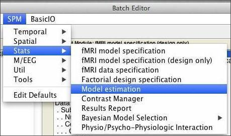

From here, all you need to do is select your SPM.mat file and click the run button. Fitting the model should take less than 5 minutes to run. If you look at the command window during this time, you'll notice that SPM is talking to you while it works:

When SPM is done talking, open the directory that you chose to save our analysis in (probably &gt;&gt;dataDIR&gt;&gt;/results/2x2). You should see that SPM produced a number of new files you:

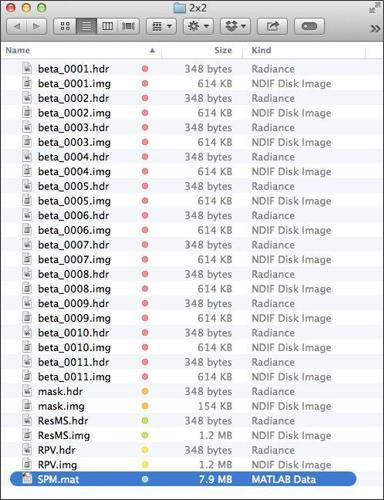

To get a sense for what information these images contain, check out this  [SPM Model Output Cheat Sheet](spmdoc/SPMdotMAT.pdf), which also contains a lot of information about the data contained within the SPM.mat file. The SPM.mat file is loaded with information. To be a power user of SPM, you will need to become intimately acquainted with that file. To learn more about the hidden charms of the SPM.mat file, check out that PDF or [this blog about it.](http://andysbrainblog.blogspot.com/2013/02/using-spmmat-to-stay-on-track-ii.html)

## 2x2 Model Contrast Specification

Now that the (General Linear) model has been fit at each voxel, we can proceed to make inferences on specific contrasts of interest. To do so, start by pressing the **Results** button in the main SPM menu window, then select the SPM.mat for your estimated 2x2 model. You should see a window like this. To add your first contrast, press**Define new contrast...**

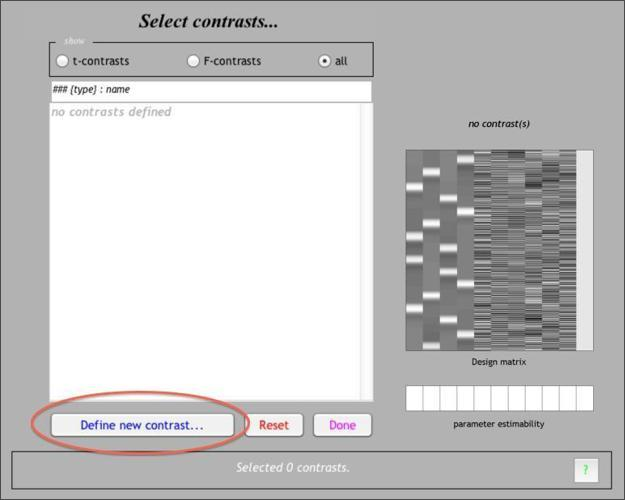

The contrast manager allows you to specify contrasts of the linear model. Both t contrasts (consisting of a single contrast vector) and F contrasts (consisting of one or more contrast vectors) can be created. Let's start with a simple effect: **WhyFace &gt; WhyHand** . To make this contrast, we need to enter a **contrast weight** of 1 to the column for **WhyFace** and -1 to the column of **WhyHand** . The resulting **contrast vector** should look like this:

Note that, if you've forgotten which columns correspond to which conditions, you can retrieve that information by Reviewing the design, as shown above. Once you've submitted that contrast, let's go ahead and define two more. The first one is the Face &gt; Hand contrast averaging across levels of the Question factor, or in other words:**WhyFaceHowFace &gt; WhyHandHowHand:**

Once you've defined that contrast, do the same for the Why &gt; How contrast averaged across levels of the Stimulus factor, or in other words: **WhyFaceWhyHand &gt; HowFaceHowHand** . If you're not sure you've done it right, here's  [how it should look](htmlfiles/contrastspec_define_contrast_sumto1.jpg). There are, in fact, many other contrasts you might apply, for instance, a t-test for the  [Question by Stimulus interaction](htmlfiles/contrastspec_define_contrast_interactioncontrast.jpg), or an  [Effects of Interest F-Test](htmlfiles/contrastspec_define_contrast_effectofinterest1.jpg). Moreover, as you'll see below, you can define your contrasts at the time you specify and estimate your design by using the  [Contrast Manager module](htmlfiles/contrastspec_define_contrast_man_batch.jpg) in the Batch Editor.

## 2x2 Model Results.

Select the WhyFaceWhyHand > HowFaceHowHand contrast. You'll be given the following options:

  1. **Apply Masking**: Select None (this can be useful with complicated experiments with many different conditions)
  2. **Title for Comparison**: Press ENTER to accept the default.
  3. **p value adjustment to control**: Select None (we'll cover control for multiple comparisons in the **Group Analysis Lab** )
  4. **"p value" or "threshold"**: Leave at 0.001 (this is an uncorrected p value threshold)
  5. **extent threshold {voxels}**: Leave at 0 (using a number greater than zero eliminates clusters smaller than that size)

After you see the glass brain view, click on the **whole brain** button in the **p-values** section of the interactive window.

This creates a table of results in the lower viewing panel. If you right-click on any area of white space (no text) in the table panel, you'll see several options for exporting the results.

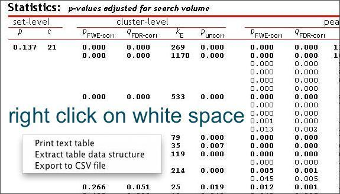

You can view the your results overlaid on the subject's normalized anatomical image. Click on **overlays**under**Display.** A drop-down menu lets you select either **slices**(axial),**sections** (orthviews), or **render** (3-D surface). Choose **sections,** and then choose your subject's normalized high-res anatomical image, wanat_hires.nii.

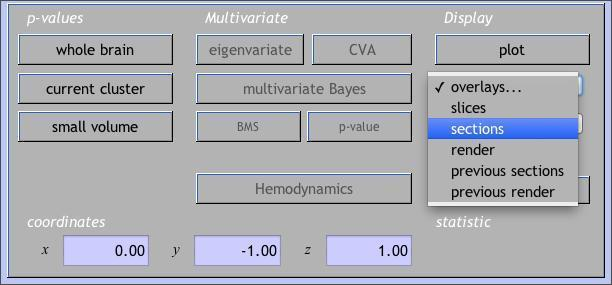

Go back and click on the **overlays** button under **Display**. Choose **render** and then choose render_single_subj.mat under rend folder in your SPM8 folder. SPM will give you a couple styling options. Play around with the options to see which one best serves your needs.

It is useful to look at the data at individual voxels. First, move the cursor to the global maximum in the glass brain view.

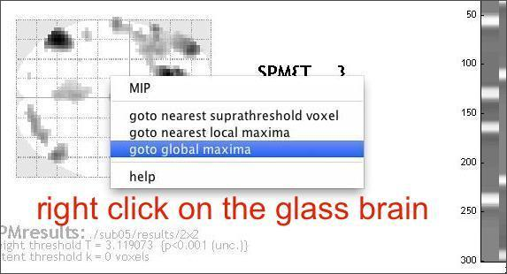

Then select from several "Plot..." functions in the lower left SPM window. Plot the **Fitted Responses** to the **WhyFaceWhyHand &gt; HowFaceHowHand** or whatever contrast is current), and choose to plot the **Adjusted** response (this option gives you both the predicted fit and the data adjusted for all nuisance effects; 'predicted' just shows the fit). Finally, plot against **Time** .

Take a close look at the plot. Can you tell what the gray line represents? What about the pink dots? Finally, do you notice any timepoints that are clear outliers?

Now click **SPM Figure:Save Figure:Specify File** at the top of the graphics window to save this image in a log file. The file is a .ps file (postscript), which you can view directly or by converting to PDF. Double clicking on the .ps file in the operating system should give you the options that you have available to you on the machine that you are working on.

Now move the cursor to a less intense voxel, perhaps an isolated one. Repeat the above steps. How are the plots different? Why is this?

## Run a Parametric Model

The 2x2 model provides information about the_average_responsivity of a subject's brain with the different task conditions. The purpose of a parametric model is to better account for within-subject variability around this average that might be explained by, for example, differences in performance to different trials. Before continuing, walk yourself through this [brief explanation](parametric-modulation) of how parametric modulator regressors are constructed.

In the behavioral data file you used to grab the onsets/durations for the 2x2 model, there is a second worksheet entitled **Parametric** that contains information about such variability. In particular, we'll use variability in response accuracy to_parametrically modulate_the amplitude (height) of the predicted response to each block.

You can use the same procedures described for the 2x2 model to specify, estimate, and apply contrasts for your parametric model. The major exception to this regards how you'll specify the task predictors in the Design Specification stage. That is, instead of specifying the 4 conditions of the 2x2 design, you're going to specify just one condition that includes every block the subject was presented with, regardless of the condition it belonged to.

The model becomes a parametric model in the next step, where you add one or more parameters that is expected to predicted variance across the scan that isn't simply explained by the fact that they're sometimes doing a task and sometimes not. Add a parametric modulator to the **Task** condition you've specified. For this modulator, you need only two pieces of information: a **Name** of the parameter (in this case, "Accuracy"), and the **Values** of this parameter.

Once that's done, add a second parametric modulator that represents the Why > How contrast, where "Why" blocks get a value of 1 and "How" blocks get a value of 0. By including this as a parametric effect alongside accuracy, we can examine the extent to which the activations observed in the 2x2 model are robust when controlling for between-block variability in accuracy.

Once you've completed the fMRI Model Specification module, go to the **Model Estimation** module. Even though you haven't created your SPM.mat yet, you can use the **depencency** option on the bottom right to tell SPM to depend on the output of the Model Specification module to get the SPM.mat file it needs. Then, you can do the same for the SPM.mat input to the **Contrast Manager** module.

Enter the contrasts as shown above, which focus on just the second and third columns of the design matrix, since those represent the Accuracy and Why>How parameters, respectively.

Then, estimate! When it's complete, review the output and explore the results as you did with the 2x2 model.

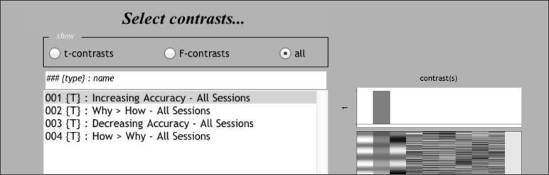

## Advanced Topics

If you feel comfortable with the procedures described above and there's still time left, check out one or more of the following advanced topics.

### Robust Estimation of Single-Subject Models

As you know by now, fMRI features a low signal to noise ratio. Some of this noise is caused by brief events that are incidental to the behavioral task the subjects are performing. For instance, your subject might cough, producing a sudden motion of the head that causes a large spike in the signal. As you might recall from the **Preprocessing Lab,** while motion correction procedures are effective at aligning the image timeseries anatomically, the functional signal often still shows residual noise. The Robust Weight Least Squares (rwls) SPM Toolbox adds functionality to SPM8 that allows you to estimate your single-subject models in a manner that is robust to this residual noise.

Start by reading out the excellent description found on the [toolbox webpage](http://www.icn.ucl.ac.uk/motorcontrol/imaging/robustWLS.html). Then, install the toolbox in the **toolbox** folder located in the folder containing the SPM software (note that it may already be there). If you installed it correctly, you should be able to see it availble in the **toolbox** list found in the SPM main window.

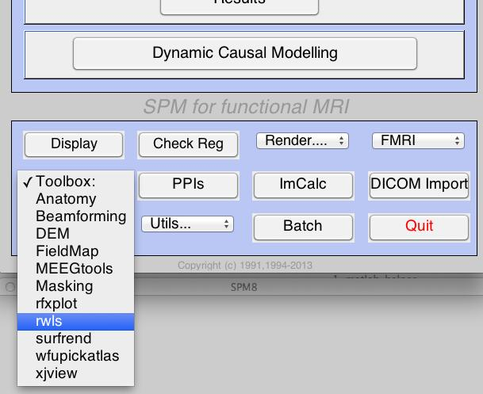

To use the toolbox, following the  [usage instructions](http://www.icn.ucl.ac.uk/motorcontrol/imaging/robustWLS_spm8.html)provided on the webpage. Once you're ready, re-estimate one of your models using the estimation option provided by the toolbox. Note that the procedures for doing so are nearly identical. The only difference is that you will create the Model Specification and Model Estimation batch jobs through the options provided by the toolbox.

Once you successfully estimate your model, use the **Plot Residual Timeseries** feature to examine the performance of the robust estimation. Then, check out the results and compare them to the original model. Did it help? (Given that these subjects were selected for being generally low in motion, you may not notice much difference.)

### Scrubbing Bad Timepoints with Custom Nuisance Regressors

In the models you've already done, you used the motion parameters from the rp*txt file as **nuisance regressors** in the GLM. Here, you'll see how to create additional nuisance regressors that will probably do a better job of explaining the artifactual BOLD signal in your images. Briefly, the approach taken here is as follows:

  1. Compute an index of "noisiness" for every image in the timeseries. Here, the index used is called the **Derivative VARiance (DVARS),** which was validated in [Power et al. (2011).](http://www.ncbi.nlm.nih.gov/pmc/articles/PMC3254728/)Briefly, DVARS summarizes the extent to which there was a global (i.e,. across the entire brain) shift in signal in an image (e.g, swrun_01.nii,100) when compared to the image collected immediately before it (e.g., swrun_01.nii,99). When DVARS is high, an artifact is probably to blame.
  2. Once you've computed DVARS for every image (image 1 is given a DVARS of 0), use some cutoff point to identify the timepoints that are "bad", and create a separate dummy regressor for each that contains a zero for every timepoint except for the one identified as "bad". These regressors can then be added to the rp*txt file for use as nuisance covariates in your single-subject model. This approach effectively "scrubs" or "censors" these timepoints from the timeseries.

Implementing this is easy with the program **scrubTimeseries.m**, which utilizes the functions for calculating DVARS in the [BRAMILA tools.](http://becs.aalto.fi/~eglerean/bramila.html/)To run the program with the default values, simply enter **scrubTimeseries**at the MATLAB command line. You will see a sequence of 2 file selection dialogues where you will select:

  1. The 4D image file you would like to scrub (swrun_01.nii)
  2. The realignment (motion) parameter file for the 4D image you would like to scrub (rp_run_01.txt)

If all goes well, you should see a plot like this, which shows both the motion parameters (top) and the timeseries of DVARS (bottom).

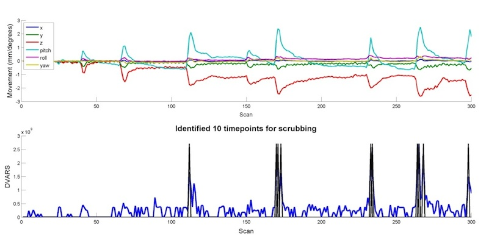

In addition, the program will automatically create a new text file that contains both the original motion parameters as well as the dummy regressors identified by examining DVARS. This will be saved in the same directory as the original rp*txt file, and will have "dvars" prepended to the name. Below is a matrix representation of the new file that was created, which can now be entered into the **Multiple Regressors** field of Model Specification.

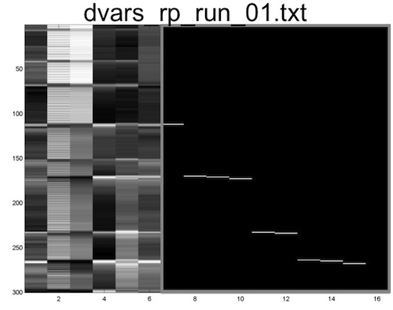

If you have time, re-estimate one of your single subject models using these nuisance covariates (make sure to create a new folder and specify it as the location of the analysis), and see if it improves the results.
