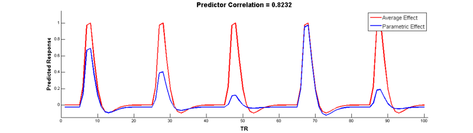
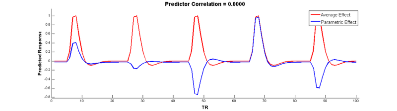

In SPM, a parametric modulation regressor is used to predict variability in the strength (that is, height/amplitude) of the neural response across different instances of the same condition. To construct such a regressor, we first need to construct a regressor that represents the mean or time-invariant neural response to the condition:

```matlab
nTR = 100;                  % number of TRs
onsets = [5 25 45 65 85];   % trial onsets (in TRs)
ME = zeros(nTR,1);          % creates a vector of 100 TRs (all zeros for now)
ME(onsets) = 1;             % puts 1s where trial onsets occu
```

Note that the height of the predicted response doesn't change over time:


Convolve with a hemodynamic response function (HRF) to make a BOLD prediction:

```matlab
bf = spm_hrf(2);        % define the basis function
cME = conv(bf,ME);      % convolve main effect with basis function
cME = cME(1:nTR);       % remove extra values added by convolution
cME = cME/max(cME);     % scale to a max of 1 (for visual comparison)
```


Now, use a parameter to create a new regressor that modulates the height of the main effect regressor

```matlab
parameter = [5 3 1 7 1.5];              % the parameter (size corresponds to onsets)
PM = zeros(nTR,1);                      % creates a vector of 100 TRs (all zeros for now)
PM(onsets) = parameter/max(parameter);  % puts same scale as main effect
```


Convolve with the HRF:

```matlab
cPM = conv(bf,PM);      % convolve with HRF
cPM = cPM(1:100);       % remove extra values added by convolution
cPM = cPM/max(cPM);     % scale to a max of 1 (for visual comparison)
```


But wait, there's a problem here! The parametric modulation regressor is highly correlated with the main effect regressor:



Collinear regressors like these are extremely problematic for estimating regression models. Fortunately, we can eliminate this correlation by orthogonalizing the parameter _before_modulating the height of the main effect. The easiest way to do this is to simply de-mean the parameter, i.e., subtract out the mean from every value so that it is centered around 0:

```matlab
oparameter = parameter - mean(parameter);   % de-mean the parameter
oPM = zeros(nTR, 1);                        % another vector of zeros
oPM(onsets) = oparameter/max(oparameter);   % re-scale
coPM = conv(bf,oPM);                        % convolve
coPM = coPM(1:100);                         % remove extra values
coPM = coPM/max(coPM);                      % re-scale
```

Wow, no more correlation! Check it out:



In SPM, parametric modulators are automatically orthongalized by default, so you don't have to manually de-mean them yourself. However, note that when your have more than 1 parametric modulator specified for a given condition, SPM uses what is called **serial orthogonalisation**to orthogonalise the parameters. There is a good explanation of orthogonalization in SPM on the[MRC-CBU Wiki](http://imaging.mrc-cbu.cam.ac.uk/imaging/ParametricModulations).

