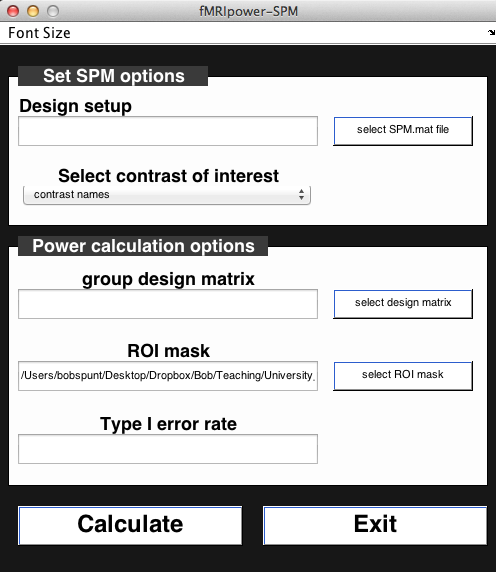
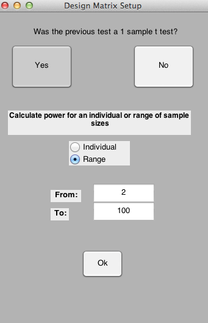
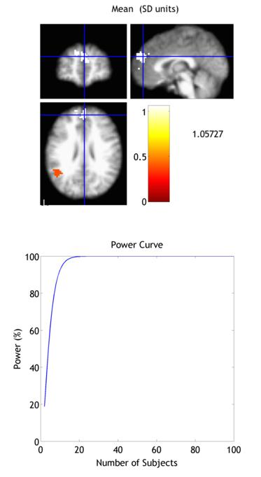



## Introduction

Statistical power is the ability to detect an effect when that effect is, in fact, present. On the one hand, statistical power allows researchers to determine, before the study begins, what they will need to do to have a really good shot (i.e., greater than 80% chance) of detecting the effect they're after (if the effect they're after truly exists). The flip side of this is that statistical power helps protect researchers - and the scientific enterprise more generally - from making Type I errors, that is, concluding that an effect is present when it is actually not.

As was noted in lecture, researchers can increase statistical power by increasing the number of participants they plan on including in the study. In fact, many funding agencies and journals now require researchers to determine their sample sizes in advance using a formal power analysis. In this exercise, you will learn how to do this using Jeanette Mumford's MATLAB tool _fMRIPower_, which is specifically designed for calculating the power of future fMRI studies. The tool is publicly available for download at: [fMRIPower.](http://fmripower.org/) Some of the content in this exercise is adapted from Dr. Mumford's published [Instructions](http://fmripower.org/instructions.pdf) for using fMRIPower, as well as the following published power calculuation guide: Mumford, J. A. (2012). A power calculation guide for fMRI studies. Soc Cogn Affect Neurosci, 7(6), 738-742.

## Overview of fMRIPower

fMRIPower is a MATLAB-based software package with GUI functionality. It performs region of interest (ROI)-based power calculations based on methods describe in Mumford and Nichols (2008). Currently, fMRIPower can only calculate power based on sample size. Given this, the power analysis must assume that the future data will be acquired using the same or similar experimental design as the pilot data used to calculate power. fMRIPower can calculate power for one-sample, two-sample, and paired-sample t-tests. In this exercise, we demonstrate how to use it to estimate the power for a one-sample t-test. Start the program by entering the following command in a MATLAB command window:

```
    fmripower_spm
```



You should now see the fMRIPower GUI. Note that the font sizes should be adjustable with shortcut keys CTRL-I (Increase) and CTRL-D (Decrease), or by using the dropdown menu.

## Step 1. Select Pilot Data**

fMRIPower performs its power calculations for a _future_ group analysis using the reuslts of an _existing_ group analysis that was estimated in either FSL or SPM. Here, we'll use a group analysis from an existing dataset including 59 neurotypical right-handed adults. Click on the**select SPM.mat file**button on the top right. Use the file selection dialogue to enter the folder **Why-How_GroupResult_One-SampleTTest_N=59** and select the file **SPM.mat** (there should be only one). Once you've done that, you should see that the**Select contrast of interest**dropdown menu has been updated to show two contrasts: **Positive,** which is the Why &gt; How comparison, and **Negative,** which is the inverse, How &gt; Why. Let's stick with Why &gt; How for now.

## Step 2. Specify Future Analysis Parameters

To specify the test you will use in your future analysis, click the**select design matrix**button. This will open a dialogue window like this:



The software should automatically detect that the pilot data used a one-sample t-test. Hence, you can click the **Yes** button to the question _"Was the previous test a 1 sample t-test?"_. Now, you can specify either a single sample size or a range of sample sizes for which to estimate power. For educational purposes, let's estimate a **Range** from **2 to 100**. Press **OK** to continue.

## Step 3. Specify Regions of Interest (ROIs)

fMRIPower does not calculate power for every voxel that was analyzed in the previous group analysis. Instead, it is based on pre-defined ROIs. By default, it will calculate power for each of the ROIs in the automated anatomical labeling (AAL) atlas (Tzourio-Mazoyer et al., 2002). These ROIs are contained in the file **aal_spm.nii** located in the **fmripower** directory. However, for now let's calculate power on a couple of ROIs that were defined using meta-analytic data from neurosynth.org for the term_mentalizing._ Press the**select ROI mask**button, navigate to the folder **ROI,** and select the ROI image ROI_MASK_DMPFC_LTPJ.nii, which contains ROIs for the dorsomedial prefrontal cortex and left temporoparietal junction. Given that one of our topics in the Group Analysis Lab is going to be ROI Selection, all you need to know for now is the following:_These ROIs were not defined based on the results observed in the existing group analysis on which the power calculations will be based._

## Step 4. Run the Power Analysis

Now you should be ready to roll. Press **Calculate.** This should take less than a minute to run. This should produce an output screen like this:



The key figure is the **Power Curve,** which plots statistical power for your future study as a function of the number of subjects you include. Although you can click around the entire brain, you'll only see a Power Curve when you click on a voxel that is in one of the two ROIs we examined. Examine the curves for both, and come up with a rough estimate of the number of subjects that each ROI needs to achieve a power of &gt;80%. Note that fMRIPower automatically saves the results of every analysis in a folder in the previous (pilot) data group analysis folder.

## Additional Resources

That was just a brief (practical) introduction to running a power analysis for a future fMRI study. To learn more about running power analyses in fMRIPower, see the [Instructions document](media/Instructions.pdf)as well as [this paper by Jeanette Mumford](media/mumford_2012.pdf). In addition, the MATLAB statistics toolbox has tools especially built for testing power, for instance the function  [SAMPSIZEPWR](http://www.mathworks.com/help/stats/sampsizepwr.html) which is specifically tailored for sample size determination (for even more MATLAB power tools, see  [here](http://www.mathworks.com/help/stats/examples/selecting-a-sample-size.html)).

